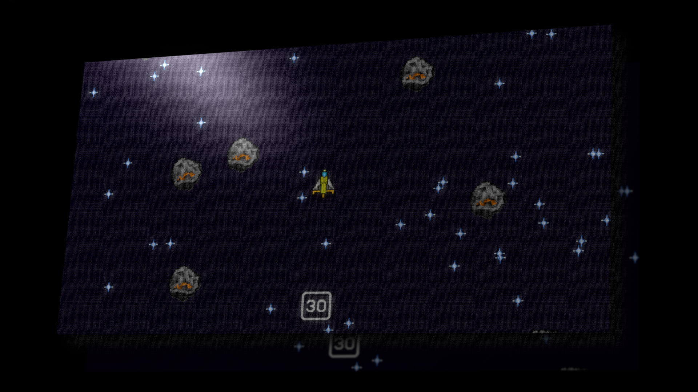

# Space Shooter



## Description

Space shooter is a top-down recreation of a popular game called "Asteroids" it contains a ship that can be controlled, a laser that can be shot, and asteroids to break apart! Contains new powerups to unlock when you collide with a lucky block! With a range of special abilities to help aid your battle with destorying asteroids in space!

## How to play?

It's a pretty easy game to play you can use "WASD" or any of the "↑ ↓ ← → (arrow keys)" for movement and "Space" to shoot your laser at asteroids!

## How do I compile it to play?

1. Clone the repo by doing:

   ```bash
   $ git clone https://github.com/andrefetch/SpaceShooter.git
   ```

   in your terminal emulator of choice

2. Install python from [here!](https://www.python.org/)

3. Install UV using your terminal by:

   **Linux / MacOS:**

   ```bash
   curl -LsSf https://astral.sh/uv/install.sh | sh
   ```

   **Windows:**

   ```powershell
   powershell -ExecutionPolicy ByPass -c "irm https://astral.sh/uv/install.ps1 | iex"
   ```

4. Open the terminal in it's root directory of the cloned folder you have which would be `Space-Shooter/` and run `uv run main.py` and you're all set!

## Open.. Sourced!

This game is completely open-sourced, you can fork / clone it if you'd like to create your own powerups, change settings in the game, or learn from it! This project utilizes the object oriented paradigm in programming, so if you'd like to learn, or improve on my codebase, feel free!
